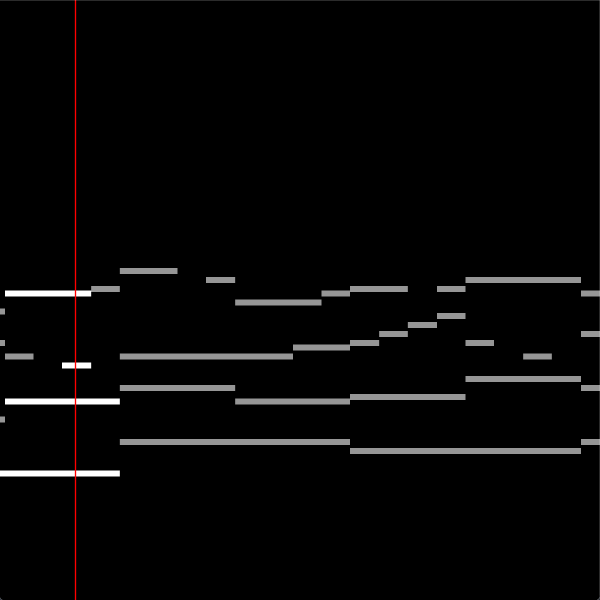

# midi-visualizer

🎵 A 2D MIDI visualizer written in Rust.

# Features

- 2D visualization of MIDI files
- Indicator
- Built-in synthesizer
- TODO: Configurable
- TODO: Export to video (Requires FFmpeg)
- TODO: Multiple channels = Multiple colors!



# Usage

TBA

# Prerequisites

- SDL2 (https://github.com/libsdl-org/SDL/releases/tag/release-2.30.6)

> You can find how to install SDL2 for rust here: <https://github.com/Rust-SDL2/rust-sdl2?tab=readme-ov-file#windows-msvc>

**OR**

Run:

```
cargo vcpkg build
```
